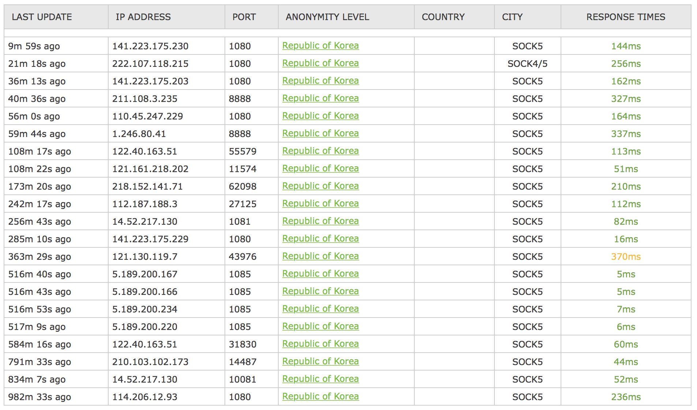

가정에서 인터넷을 사용하다 보면 미국으로 연결이 상당히 느린 경우가 있다.
지금 내가 일하고 있는 곳도 그런 상태이다.
국내 사이트 연결은 거의 지연을 느끼지 않을 정도로 빠르게 연결되나, 미국 사이트는 그렇지 않다.
일반 웹페이지는 그럭저럭 참고 사용하면 되지만 [GitHub](https://github.com)에서 linux와 같이 history가 큰 소스를 clone 하려면 하루 꼬박 걸릴 정도로 속도가 나오지 않는다.

[Who is my ISP?](https://www.whoismyisp.org) 로 확인해 보니 역시나 LG 유플러스 망을 사용하고 있다.
국내는 워낙 인터넷 망이 잘 연결되어 큰 문제가 없지만 미국과 같이 해외로 나가는 경우는 통신 사업자가 어떤 광케이블을 계약해서 사용하느냐에 따라 속도가 제각각이 된다.
해저 광케이블이 어떻게 깔려 있는지 궁금하면 [Greg's Cable Map](http://www.cablemap.info)을 보면 된다. 참고로 최신 정보는 아니지만 [2015년의 SK, KT 해저 광케이블 현황](https://namu.wiki/w/KT%20인터넷)을 보면 왜 KT가 좋은지 알 수 있다.

어쨋든 인터넷 제공 업체를 마음대로 바꿀 수 없는 상황에서, GitHub로 작업은 해야 한다면 해결 방안 중 하나가 proxy를 사용하여 다른 망을 사용하여 나가도록 하는 것이다.

## Proxy 목록 찾기

우선 한국에 있는 무료 proxy 중 범용 proxy protocol인 SOCKS를 지원하는 것을 찾아야 한다. 이와 같은 무료 proxy 목록을 제공하는 곳은 많은데, 내가 사용한 곳은 [GatherProxy](http://www.gatherproxy.com/sockslist/country/?c=Republic%20of%20Korea)이다.



이들 중 SSH 연결을 거절하는 경우도 있으므로 응답이 좋은 순서대로 하나씩 적용하면서 사용할 수 있는 proxy를 고르면 된다.

## GitHub에 HTTPS로 연결하기

Public repository 이고, 소스를 commit 하지 않는다면 git을 HTTPS로 연결해도 된다.
이때는 git config에서 제공하는 http.proxy 를 설정할 수 있다. 위 목록 중 141.223.175.230:1080 proxy를 사용한다고 하면 다음과 같이 설정하면 된다.

```sh
$ git config --global http.https://github.com.proxy socks5://141.223.175.230:1080
```

위와 같이 전역적으로 설정하게 되면 ~/.gitconfig 에 아래와 같이 필드가 생성된다.
```
[http "https://github.com"]
	proxy = socks5://141.223.175.230:1080
```

Proxy를 설정하기 전에 소스를 받아보면 아래와 같은 속도가 나온다.
```sh
$ git clone https://github.com/aws/aws-sdk-cpp.git
Cloning into 'aws-sdk-cpp'...
remote: Counting objects: 275205, done.
remote: Compressing objects: 100% (817/817), done.
Receiving objects:   0% (393/275205), 108.01 KiB | 14.00 KiB/s
```

언제 다 받을지 기약이 없다. 이를 proxy로 설정해서 실행해 보면 아래와 같은 속도가 나온다.
```sh
$ git clone https://github.com/aws/aws-sdk-cpp.git
Cloning into 'aws-sdk-cpp'...
remote: Counting objects: 275205, done.
remote: Compressing objects: 100% (817/817), done.
Receiving objects:   6% (16513/275205), 6.88 MiB | 3.41 MiB/s
```

14KiB/s 에서 3.41MiB/s로 무려 200배 이상 속도가 빨라졌다.


## GitHub에 SSH로 연결하기

Code를 패스워드 없이 commit하려면 SSH로 연결을 하여야 한다. SSH 설정은 git config 를 사용하지 않고, ssh config 로 설정한다.

아래와 같이 ~/.ssh/config 파일에 ProxyCommand 로 netcat(nc)를 이용하여 설정하면 된다.

```sh
$ cat ~/.ssh/config
Host github.com
    User git
    ProxyCommand nc -x  141.223.175.230:1080 %h %p
```

마찬가지로 SSH 연결도 사용할 만한 수준이 되었다.

```sh
$ git clone git@github.com:aws/aws-sdk-cpp.git
Cloning into 'aws-sdk-cpp'...
remote: Counting objects: 275205, done.
remote: Compressing objects: 100% (817/817), done.
Receiving objects: 2.7% (19265/275205), 8.18 MiB | 812.00 KiB/s
```

## 정리

고정된 proxy가 있다면 좋겠지만, 없다면 proxy 연결이 안될 때마다 다른 proxy를 찾아서 적어 주어야 한다. 그나마 다행인 것은 fetch를 할 때는 추가된 부분만 받기 때문에 저속이어도 그럭저럭 사용할 수 있다.

이런 고민을 하지 않는 좋은 환경을 갖추는 것이 최선이겠지만...

* 참고
  - [Configure Git to use a proxy](https://gist.github.com/evantoli/f8c23a37eb3558ab8765)
  - [Tutorial: how to use git through a proxy](http://cms-sw.github.io/tutorial-proxy.html)
  - [Socat: A very powerful networking tool](http://www.rubyguides.com/2012/07/socat-cheatsheet/)
